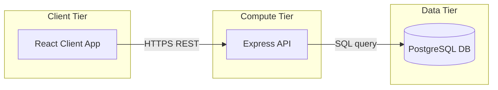
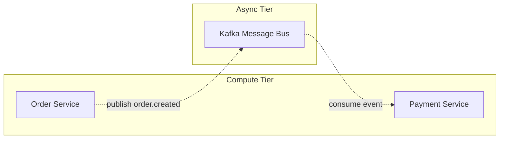
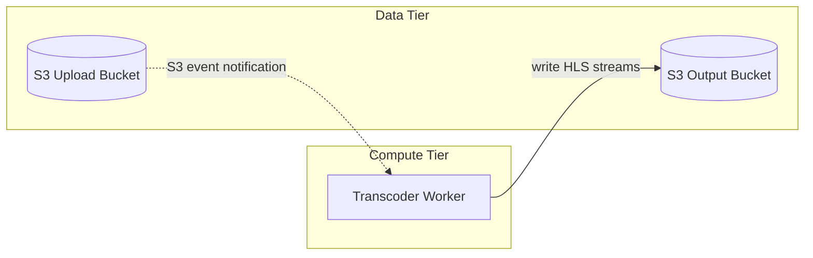
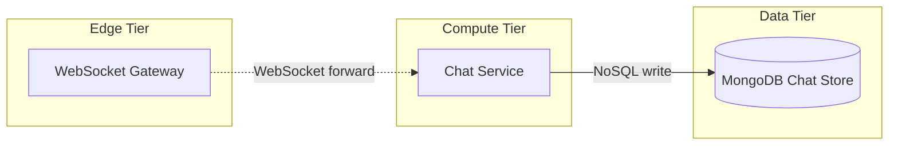

# ArchDraw — Diagram Generation Rules

All diagrams MUST be generated by outputting valid Mermaid graph code and calling the `generate_diagram` tool with the `mermaid` parameter.

## Mermaid Format Requirements:
1. **Subgraphs**: Every node MUST reside inside a subgraph container, e.g., `subgraph Client["Client Tier"] ... end`.
2. **Node IDs**: Use PascalCase of the full component name (e.g. `AuthService`, not `AS`).
3. **Node Labels**: Must NOT include any technology/programming language stack subtitles in square brackets. Keep labels clean (e.g., `WebApp["Web App"]`).
4. **Cylinder Shapes**: Every database, cache, or object storage node MUST use cylinder syntax without any tech stack subtitle inside (e.g., `NodeId[("Label")]`).
5. **Edge Styles**: Synchronous (HTTP/SQL/gRPC) -> solid `-->`; Asynchronous/Events/WebSockets -> dashed `-.->`. Every edge MUST be labeled with the protocol/event in quotes: `-->|"Protocol"|` or `-.->|"Event"|`.
6. **No Gateway Bypass**: Clients must route through API Gateway. No direct connections from client to internal services/databases.
7. **Auth Routing**: Gateway routes auth requests directly to the Auth Service. No other service hops through Auth Service.

---

## FEW-SHOT EXAMPLES (PROMPT TO MERMAID TRANSLATION)

### Example 1: 3-Tier Web App
* **User Prompt**: "Create a 3-tier Web App with a React client, Express API, and PostgreSQL database."
* **Mermaid Output**:

### Example 2: E-Commerce Queue
* **User Prompt**: "Draw an e-commerce backend with an Order Service publishing order events to Kafka and a Payment Service consuming them."
* **Mermaid Output**:

### Example 3: VOD Video Streaming
* **User Prompt**: "Create a video transcoder where raw uploads to S3 trigger an FFmpeg worker which writes HLS output to an output S3 bucket."
* **Mermaid Output**:

### Example 4: Real-time Live Chat
* **User Prompt**: "Design a live chat where client connects to WebSocket gateway which forwards chat messages to a Chat Service to store in MongoDB."
* **Mermaid Output**:

