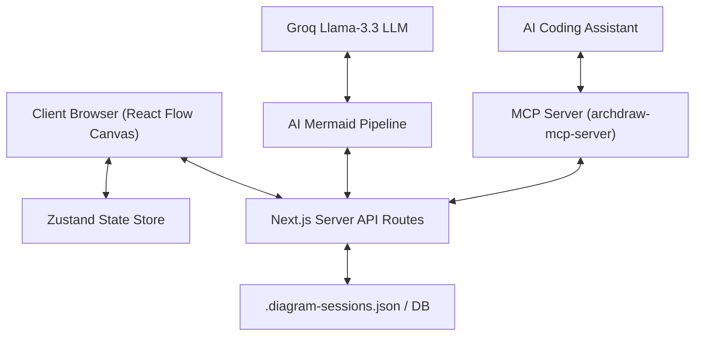

# ArchDraw — System Architecture Documentation

This document describes the core architecture, data flows, and technical implementation of the **ArchDraw** diagramming platform.

---

## 1. High-Level Architecture Overview

ArchDraw is a web-based, AI-assisted interactive diagramming application built using **Next.js 16 (App Router)**, **React Flow (v11)**, **Zustand**, and a custom **Model Context Protocol (MCP) server**. 

The system splits into three main parts:
1. **Interactive Frontend Canvas**: A React Flow canvas allowing users to visually manipulate, group, and style architectural nodes and edges.
2. **Next.js API Backend**: Serverless API endpoints for loading, exporting, sharing, and caching diagram sessions.
3. **MCP Server & AI Generation Pipeline**: A multi-agent framework that parses, validates, layouts, and translates system prompts and Mermaid syntax into valid React Flow JSON states.

---

## 2. Core Features & Implementation Details

### A. Dynamic Layout & Positioning Engine
Instead of random placement or manual-only alignment, ArchDraw runs structured layout algorithms to calculate node coordinates:
- **ELK (Eclipse Layout Kernel)**: Used on both the frontend (`layoutUtils.ts`) and the MCP server (`elk-runner.ts`) to compute layered/hierarchical diagram flows. It manages margins, tier alignment, and container padding dynamically.
- **Dagre Layout**: Integrated with the Mermaid parsing pipeline to calculate coordinates for subgraphs and node nodes based on Mermaid's directional layout rules (`graph LR`, `graph TD`).
- **Collision Resolution**: A custom collision resolution module (`resolveNodeCollisions`) automatically offsets overlapping nodes when they are dragged near each other.

### B. The AI Mermaid Diagramming Pipeline
When diagrams are requested via the web prompt bar, the app routes execution through a robust **Multi-Stage AI Pipeline** located in `lib/ai/pipeline/mermaid-pipeline`:
1. **Stage 1 (Pre-Generation)**: An LLM plans the system inventory, categories, tech stack names, and group assignments from the raw prompt.
2. **Stage 2 (Mermaid Code Generation)**: The system instructs an LLM to generate raw Mermaid graph syntax. To prevent syntax errors, this stage generates the subgraph containers/nodes first, and then connects them with edge definitions.
3. **Stage 3 (Validation & Self-Repair)**: Programmatic parsers inspect the Mermaid AST. If any connection or shape rules are violated (e.g. backward client edges or invalid node shapes), the system feeds the syntax errors back to the generator LLM for repair (up to 16 retries).
4. **Translation & Styling**: The parser translates the validated Mermaid syntax into React Flow node and edge objects, applying color codes and matching styles based on the identified technology tiers.

### C. Zustand State Management
The Zustand store (`diagramStore.ts`) serves as the single source of truth for the active canvas state. It handles:
- **Multi-Canvas Tabs**: Manages an array of `canvases`. Canvases have unique, incremental IDs (`canvas-1`, `canvas-2`, etc.) which are calculated dynamically from the active list, keeping work clean and identifiable.
- **History Undo/Redo**: Maintains a stack of `past` and `future` states, pushing changes after node drags, updates, or edge connections.
- **Cosmetic Handling**: Automatically maps node handles and calculates floating edge vectors in real-time, removing edge overlap using the `SimpleFloatingEdge` component.

### D. Session Management & Share Routes
- **Session Loading API (`/api/diagram/load`)**: Receives requests containing raw JSON diagram elements or raw Mermaid code. If Mermaid is passed, it executes `runMermaidPipeline` server-side, layouts the resulting diagram, saves it under a unique, incremental code (e.g., `session-1`, `session-2`), and returns the editor URL.
- **Public Share Viewers**: Shares are accessed via `/share/[id]`, which loads read-only snapshots from the `.diagram-sessions.json` storage file (or Supabase PostgreSQL profiles).

### E. Model Context Protocol (MCP) Server
The `archdraw-mcp-server` allows external LLM coding assistants to manipulate the canvas on the user's behalf:
- **`generate_diagram`**: Accepts a `mermaid` code block or `nodes`/`edges` JSON. It forwards the request to the Next.js API to run layout algorithms and returns a `diagramUrl` (e.g. `http://localhost:3000/editor?session=session-1`) for the user.
- **`fix_layout`**: Re-evaluates existing node geometries and applies standard tier offsets.
- **`export_diagram`**: Contacts the export API to pull the JSON data or convert the layout to PNG/SVG images.

---

## 3. Technology Stack

- **Framework**: Next.js 16 (App Router) + React 19 + TypeScript
- **State Management**: Zustand
- **Canvas Rendering**: React Flow
- **Auto-Layout**: ELK (elkjs) + Dagre
- **CSS Engine**: Tailwind CSS v4
- **Database / Auth**: Supabase (PostgreSQL, Magic Link OTP)
- **External LLM Interface**: Groq API (Llama 3.3 70B)
