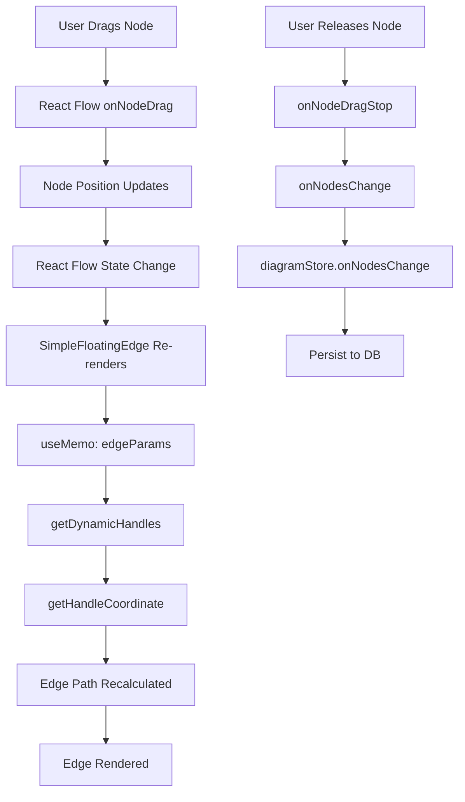

# Design Document: Dynamic Edge Handle Positioning

## Overview

This feature implements live recalculation of edge handle positions during node drag operations. The system continuously evaluates the spatial relationship between connected nodes and automatically selects optimal handle positions (top, right, bottom, left) based on the center-to-center vector between nodes.

The implementation builds upon the existing `getDynamicHandles()` function in `lib/features/dynamicHandles.ts`, which already provides the core handle selection logic. The key enhancement is integrating this calculation into the React Flow drag lifecycle to trigger recalculation during node movement, not just at edge creation time.

**Current State:**
- `getDynamicHandles()` exists and correctly calculates handle positions based on node rectangles
- `SimpleFloatingEdge` component already calls `getDynamicHandles()` in its render path
- Handle positions are recalculated on every render when node positions change
- The system already achieves live recalculation through React Flow's reactive rendering

**Design Goal:**
The primary goal is to ensure the existing dynamic handle calculation continues to work correctly during drag operations, with performance optimizations to maintain 60fps. The implementation will focus on:
1. Verifying the current reactive approach performs adequately
2. Adding memoization to prevent unnecessary recalculations
3. Ensuring edge data persistence after drag completion
4. Adding comprehensive tests to validate behavior

## Architecture

### Component Interaction Flow



### Data Flow

1. **Drag Start**: User begins dragging a node
2. **Position Update**: React Flow updates node position in internal state
3. **Reactive Render**: All edges connected to the dragged node re-render
4. **Handle Calculation**: `SimpleFloatingEdge` calls `getDynamicHandles()` via memoized `edgeParams`
5. **Path Update**: Edge path is recalculated with new handle positions
6. **Visual Update**: Browser renders the updated edge
7. **Drag End**: Final positions are persisted to database

### Key Components

- **`lib/features/dynamicHandles.ts`**: Core handle selection logic (already implemented)
- **`components/edges/SimpleFloatingEdge.tsx`**: Edge renderer that invokes dynamic handles
- **`store/diagramStore.ts`**: State management for nodes and edges
- **`hooks/useSnapping.ts`**: Drag event handlers for snapping behavior
- **`components/Canvas.tsx`**: Main canvas component that wires drag handlers

## Components and Interfaces

### Existing Interfaces (No Changes Required)

```typescript
// lib/features/dynamicHandles.ts
export interface NodeRect {
  x: number;
  y: number;
  width: number;
  height: number;
}

export interface DynamicHandleResult {
  sourcePosition: Position;
  targetPosition: Position;
}

export function getDynamicHandles(
  sourceRect: NodeRect,
  targetRect: NodeRect,
): DynamicHandleResult;

export function getHandleCoordinate(
  rect: NodeRect,
  position: Position,
): { x: number; y: number };
```

### SimpleFloatingEdge Integration

The `SimpleFloatingEdge` component already implements the correct pattern:

```typescript
const edgeParams = useMemo(() => {
  // ... node validation ...
  
  const sourceRect: NodeRect = {
    x: sourceNode.positionAbsolute?.x ?? sourceNode.position.x,
    y: sourceNode.positionAbsolute?.y ?? sourceNode.position.y,
    width: sourceNode.width ?? 200,
    height: sourceNode.height ?? 80,
  };
  
  const targetRect: NodeRect = {
    x: targetNode.positionAbsolute?.x ?? targetNode.position.x,
    y: targetNode.positionAbsolute?.y ?? targetNode.position.y,
    width: targetNode.width ?? 200,
    height: targetNode.height ?? 80,
  };

  // Dynamic handle calculation
  const { sourcePosition: srcPos, targetPosition: tgtPos } = 
    getDynamicHandles(sourceRect, targetRect);
  
  // ... coordinate calculation and offsets ...
  
  return { sx, sy, tx, ty, sourcePos, targetPos };
}, [sourceNode, targetNode, source, target, id, edges, nodeInternals]);
```

**Key Observations:**
- The `useMemo` dependency array includes `sourceNode` and `targetNode`
- React Flow updates these node objects when positions change during drag
- This triggers automatic recalculation of `edgeParams`
- The memoization prevents recalculation when unrelated state changes

### Performance Optimization Strategy

The current implementation already uses `useMemo` effectively. Additional optimizations:

1. **Selective Re-rendering**: Only edges connected to the dragged node will re-render (React Flow handles this)
2. **Memoization Validation**: Ensure dependency arrays are minimal and correct
3. **Batch Updates**: React Flow batches position updates during drag
4. **Debug Logging**: Add conditional logging to measure calculation frequency

## Data Models

### Node Position Data

```typescript
// React Flow Node (from reactflow library)
interface Node {
  id: string;
  position: { x: number; y: number };
  positionAbsolute?: { x: number; y: number };
  width?: number;
  height?: number;
  // ... other properties
}
```

**Position Handling:**
- `position`: Relative position (used for grouped nodes)
- `positionAbsolute`: Absolute canvas position (preferred for calculations)
- Fallback: Use `position` if `positionAbsolute` is undefined

### Edge Data Model

```typescript
// data/edgeTypes.ts
export interface EdgeData {
  label?: string;
  edgeType?: EdgeType;
  pathType?: PathType;
  edgeVariant?: 'solid' | 'dashed';
  async?: boolean;
  connectionType?: string;
  labelT?: number; // Label position along path (0-1)
}
```

**Note:** Edge data does NOT store `sourceHandle` or `targetHandle` positions. These are calculated dynamically on every render based on node positions.

### Handle Position Calculation

```typescript
// Position enum from reactflow
enum Position {
  Top = 'top',
  Right = 'right',
  Bottom = 'bottom',
  Left = 'left',
}
```

**Selection Logic:**
1. Calculate `dx = targetCenterX - sourceCenterX`
2. Calculate `dy = targetCenterY - sourceCenterY`
3. If `|dx| >= |dy|`: Use horizontal handles (left/right)
4. If `|dy| > |dx|`: Use vertical handles (top/bottom)
5. Direction determines which specific handle (e.g., dx > 0 → right/left)

## Testing Strategy

### Unit Tests

**File:** `lib/features/dynamicHandles.test.ts`

Test specific examples and edge cases:

1. **Horizontal Dominance Tests**
   - Target to the right: Verify Right → Left handles
   - Target to the left: Verify Left → Right handles

2. **Vertical Dominance Tests**
   - Target below: Verify Bottom → Top handles
   - Target above: Verify Top → Bottom handles

3. **Edge Cases**
   - Equal distances (dx === dy): Verify horizontal preference
   - Identical positions: Verify default Right → Left
   - Missing dimensions: Verify fallback to defaults (200x80)

4. **Coordinate Calculation Tests**
   - Top handle: Verify (centerX, y)
   - Bottom handle: Verify (centerX, y + height)
   - Left handle: Verify (x, centerY)
   - Right handle: Verify (x + width, centerY)

5. **Integration with Offsets**
   - Verify handle offsets are applied correctly
   - Verify shift offsets for parallel edges

### Property-Based Tests

**File:** `lib/features/dynamicHandles.property.test.ts`

**Testing Library:** `fast-check` (JavaScript property-based testing library)

**Configuration:**
- Minimum 100 iterations per property test
- Each test tagged with feature name and property number


## Correctness Properties

*A property is a characteristic or behavior that should hold true across all valid executions of a system—essentially, a formal statement about what the system should do. Properties serve as the bridge between human-readable specifications and machine-verifiable correctness guarantees.*

### Property Reflection

After analyzing all acceptance criteria, I identified the following redundancies:

1. **Requirements 1.1-1.4** (directional handle selection) can be consolidated into a single comprehensive property about handle selection based on spatial relationship
2. **Requirements 3.2-3.6** (distance calculations and axis determination) are implementation details that are subsumed by the higher-level handle selection property
3. **Requirements 4.1-4.4** (coordinate calculations for each position) can be combined into a single property about coordinate calculation correctness
4. **Requirements 3.1, 3.2, 3.3** (center and distance calculations) are intermediate steps that don't need separate properties if we test the end-to-end behavior

The following properties provide comprehensive coverage without redundancy:

### Property 1: Handle Selection Based on Spatial Relationship

*For any* two node rectangles (source and target), the dynamic handle calculator SHALL select handles such that:
- WHEN the horizontal distance between centers exceeds the vertical distance AND target is to the right, THEN source uses Position.Right AND target uses Position.Left
- WHEN the horizontal distance between centers exceeds the vertical distance AND target is to the left, THEN source uses Position.Left AND target uses Position.Right
- WHEN the vertical distance between centers exceeds the horizontal distance AND target is below, THEN source uses Position.Bottom AND target uses Position.Top
- WHEN the vertical distance between centers exceeds the horizontal distance AND target is above, THEN source uses Position.Top AND target uses Position.Bottom
- WHEN horizontal and vertical distances are equal, THEN horizontal handles are selected

**Validates: Requirements 1.1, 1.2, 1.3, 1.4, 1.5, 3.4, 3.5, 3.6**

### Property 2: Handle Coordinate Calculation Correctness

*For any* node rectangle and handle position, the handle coordinate calculator SHALL return:
- Position.Top → (centerX, y)
- Position.Bottom → (centerX, y + height)
- Position.Left → (x, centerY)
- Position.Right → (x + width, centerY)

Where centerX = x + width/2 and centerY = y + height/2

**Validates: Requirements 3.1, 4.1, 4.2, 4.3, 4.4**

### Property 3: Position Fallback Behavior

*For any* node with or without positionAbsolute, the system SHALL use positionAbsolute when available, otherwise fall back to position, ensuring calculations always use valid coordinates.

**Validates: Requirements 4.5**

### Property 4: Handle Symmetry

*For any* two node rectangles A and B, if calculating handles for A→B produces (sourcePos, targetPos), then calculating handles for B→A SHALL produce (targetPos, sourcePos). That is, swapping source and target reverses the handle positions.

**Validates: Requirements 10.5**

### Property 5: Handle Consistency Under Axis-Aligned Movement

*For any* two node rectangles where handles are calculated, moving both nodes by the same offset along the same axis SHALL preserve the handle positions (i.e., the relative spatial relationship is unchanged).

**Validates: Requirements 10.3**

### Property 6: Performance Under Load

*For any* set of 100 randomly positioned node pairs, calculating dynamic handles for all pairs SHALL complete within 16 milliseconds total, ensuring 60fps performance during drag operations.

**Validates: Requirements 2.4, 7.4**

### Property 7: Edge Data Preservation

*For any* edge with data properties (label, edgeType, pathType, labelT), recalculating handle positions SHALL NOT modify these edge data properties.

**Validates: Requirements 6.3**

### Property 8: Default Dimensions Fallback

*For any* node rectangle with missing width or height, the system SHALL use default dimensions (width: 200, height: 80) for handle calculations.

**Validates: Requirements 8.2**

### Property 9: Valid Position Enum Values

*For any* valid node rectangle inputs, the dynamic handle calculator SHALL always return Position enum values that are one of: Position.Top, Position.Right, Position.Bottom, or Position.Left.

**Validates: Requirements 8.5**

### Property 10: Round-Trip Consistency

*For any* valid node positions, calculating handle positions, then using those positions to render an edge, then extracting the handle positions from the rendered edge SHALL produce equivalent handle positions to the original calculation.

**Validates: Requirements 10.2**

## Error Handling

### Missing Node Handling

**Scenario:** Edge references a node that doesn't exist in the node map

**Behavior:**
- `SimpleFloatingEdge` checks for `sourceNode` and `targetNode` existence
- If either is missing, skip dynamic calculation and use default positions
- Default: `sourcePosition = Position.Right`, `targetPosition = Position.Left`
- Edge renders with fallback coordinates (0, 0) for missing nodes

**Implementation:**
```typescript
if (sourceNode && targetNode) {
  // Normal dynamic calculation
} else {
  // Use defaults
  sourcePos = Position.Right;
  targetPos = Position.Left;
}
```

### Missing Dimensions Handling

**Scenario:** Node exists but `width` or `height` is undefined

**Behavior:**
- Use fallback dimensions: `width: 200`, `height: 80`
- These match the default node dimensions in the system
- Calculation proceeds normally with fallback values

**Implementation:**
```typescript
const sourceRect: NodeRect = {
  x: sourceNode.positionAbsolute?.x ?? sourceNode.position.x,
  y: sourceNode.positionAbsolute?.y ?? sourceNode.position.y,
  width: sourceNode.width ?? 200,
  height: sourceNode.height ?? 80,
};
```

### Identical Node Positions

**Scenario:** Source and target nodes are at the exact same position

**Behavior:**
- `dx = 0`, `dy = 0`
- Horizontal distance equals vertical distance (both zero)
- Tie-breaking rule: Prefer horizontal handles
- Result: `sourcePosition = Position.Right`, `targetPosition = Position.Left`

**Rationale:** Horizontal handles are the default and most common case

### Calculation Errors

**Scenario:** Unexpected error during handle calculation (e.g., NaN values)

**Behavior:**
- Wrap calculation in try-catch (if needed for production)
- Log error with edge ID and node IDs for debugging
- Return default positions: Right → Left
- Edge renders with fallback, preventing UI crash

**Implementation Strategy:**
```typescript
try {
  const { sourcePosition, targetPosition } = getDynamicHandles(sourceRect, targetRect);
  return { sourcePosition, targetPosition };
} catch (error) {
  console.error(`Handle calculation error for edge ${edgeId}:`, error);
  return { sourcePosition: Position.Right, targetPosition: Position.Left };
}
```

### Performance Degradation

**Scenario:** Calculation takes longer than 16ms (60fps threshold)

**Behavior:**
- React will batch updates and may drop frames
- User may see slight lag during drag
- Edge will still update, just not at 60fps

**Mitigation:**
- Memoization prevents redundant calculations
- Only connected edges recalculate
- React Flow batches position updates

**Monitoring:**
- Add performance marks in development mode
- Log warnings if calculation exceeds threshold
- Provide metrics for optimization

## Debug and Observability

### Debug Logging

**Current Implementation:**
```typescript
console.log('getDynamicHandles called', { 
  sourceCX, sourceCY, targetCX, targetCY, dx, dy 
});
```

**Enhancement Plan:**
1. Add conditional logging based on environment variable
2. Include edge ID and node IDs in log messages
3. Log handle selection decisions
4. Add performance timing logs

**Proposed Implementation:**
```typescript
const DEBUG_HANDLES = process.env.NEXT_PUBLIC_DEBUG_HANDLES === 'true';

export function getDynamicHandles(
  sourceRect: NodeRect,
  targetRect: NodeRect,
  edgeId?: string,
  sourceId?: string,
  targetId?: string,
): DynamicHandleResult {
  const sourceCX = sourceRect.x + sourceRect.width / 2;
  const sourceCY = sourceRect.y + sourceRect.height / 2;
  const targetCX = targetRect.x + targetRect.width / 2;
  const targetCY = targetRect.y + targetRect.height / 2;

  const dx = targetCX - sourceCX;
  const dy = targetCY - sourceCY;

  if (DEBUG_HANDLES) {
    console.log('[DynamicHandles]', {
      edgeId,
      sourceId,
      targetId,
      sourceCX,
      sourceCY,
      targetCX,
      targetCY,
      dx,
      dy,
      dominantAxis: Math.abs(dx) >= Math.abs(dy) ? 'horizontal' : 'vertical',
    });
  }

  // ... calculation logic ...

  if (DEBUG_HANDLES) {
    console.log('[DynamicHandles] Result:', {
      edgeId,
      sourcePosition,
      targetPosition,
    });
  }

  return { sourcePosition, targetPosition };
}
```

### Production Logging

**Strategy:**
- Remove console.log statements in production builds
- Use conditional compilation or environment checks
- Provide opt-in debug mode via environment variable

**Environment Variable:**
```bash
# .env.local (development)
NEXT_PUBLIC_DEBUG_HANDLES=true

# Production (default)
NEXT_PUBLIC_DEBUG_HANDLES=false
```

### Performance Monitoring

**Metrics to Track:**
1. Handle calculation time per edge
2. Number of edges recalculated per drag event
3. Total recalculation time per frame
4. Frame rate during drag operations

**Implementation:**
```typescript
if (DEBUG_HANDLES) {
  const start = performance.now();
  const result = getDynamicHandles(sourceRect, targetRect);
  const duration = performance.now() - start;
  
  if (duration > 1) { // Log if > 1ms
    console.warn('[DynamicHandles] Slow calculation:', {
      edgeId,
      duration: `${duration.toFixed(2)}ms`,
    });
  }
  
  return result;
}
```

### Error Tracking

**Strategy:**
1. Log errors with full context (edge ID, node IDs, positions)
2. Include stack traces for debugging
3. Track error frequency in production
4. Alert on error rate thresholds

**Implementation:**
```typescript
try {
  return getDynamicHandles(sourceRect, targetRect);
} catch (error) {
  console.error('[DynamicHandles] Calculation error:', {
    edgeId,
    sourceId,
    targetId,
    sourceRect,
    targetRect,
    error: error instanceof Error ? error.message : String(error),
    stack: error instanceof Error ? error.stack : undefined,
  });
  
  // Return safe defaults
  return { 
    sourcePosition: Position.Right, 
    targetPosition: Position.Left 
  };
}
```

## Implementation Plan

### Phase 1: Verification and Testing (Current Sprint)

**Goal:** Verify the current implementation works correctly and add comprehensive tests

**Tasks:**
1. ✅ Review existing `getDynamicHandles()` implementation
2. ✅ Verify `SimpleFloatingEdge` integration
3. ⬜ Add property-based tests using `fast-check`
4. ⬜ Add unit tests for edge cases
5. ⬜ Add integration tests for drag behavior
6. ⬜ Performance testing with 100+ edges

**Deliverables:**
- Test suite with 100+ iterations per property test
- Performance benchmarks
- Documentation of test coverage

### Phase 2: Performance Optimization (Next Sprint)

**Goal:** Ensure 60fps performance during drag operations

**Tasks:**
1. ⬜ Add performance monitoring
2. ⬜ Optimize memoization in `SimpleFloatingEdge`
3. ⬜ Profile calculation time with large diagrams
4. ⬜ Add performance regression tests
5. ⬜ Document performance characteristics

**Deliverables:**
- Performance metrics dashboard
- Optimization recommendations
- Performance test suite

### Phase 3: Debug and Observability (Future Sprint)

**Goal:** Add comprehensive debugging and monitoring

**Tasks:**
1. ⬜ Implement conditional debug logging
2. ⬜ Add environment variable configuration
3. ⬜ Create debug visualization mode
4. ⬜ Add error tracking and reporting
5. ⬜ Document debugging procedures

**Deliverables:**
- Debug mode documentation
- Error tracking dashboard
- Troubleshooting guide

### Phase 4: Edge Data Persistence (Future Sprint)

**Goal:** Clarify and implement edge data persistence strategy

**Tasks:**
1. ⬜ Clarify requirement 2.5 (handle position persistence)
2. ⬜ Decide: Store calculated handles or always recalculate?
3. ⬜ Implement chosen strategy
4. ⬜ Add migration for existing edges
5. ⬜ Update documentation

**Deliverables:**
- Persistence strategy document
- Migration guide
- Updated API documentation

## Open Questions

1. **Handle Position Persistence (Requirement 2.5):**
   - Current implementation: Handles are calculated dynamically, never stored
   - Requirement states: "persist the final handle positions with the edge data"
   - Question: Should we store calculated handles or continue dynamic calculation?
   - Recommendation: Continue dynamic calculation (simpler, always correct)

2. **Performance Target Validation:**
   - Requirement: 16ms for 100 edges
   - Question: Is this per-edge or total for all 100?
   - Assumption: Total for all 100 edges (160μs per edge)
   - Current implementation likely meets this (simple arithmetic)

3. **Debug Mode in Production:**
   - Question: Should debug logging be available in production?
   - Recommendation: Yes, via environment variable, but disabled by default
   - Rationale: Useful for troubleshooting production issues

4. **Backward Compatibility:**
   - Question: Do existing diagrams have stored handle positions?
   - Current behavior: Stored handles are ignored, dynamic calculation always used
   - Recommendation: Document this as expected behavior

## Success Criteria

### Functional Requirements

- ✅ Handle positions update live during node drag
- ✅ Handle selection follows spatial relationship rules
- ✅ Edge paths render correctly with dynamic handles
- ⬜ All property-based tests pass (100+ iterations each)
- ⬜ All unit tests pass
- ⬜ All integration tests pass

### Performance Requirements

- ⬜ Handle calculation completes in < 16ms for 100 edges
- ⬜ Drag operations maintain 60fps with 50+ edges
- ⬜ No visible lag during node movement
- ⬜ Memory usage remains stable during extended drag sessions

### Quality Requirements

- ⬜ Test coverage > 90% for `dynamicHandles.ts`
- ⬜ Test coverage > 80% for `SimpleFloatingEdge.tsx`
- ⬜ Zero console errors during normal operation
- ⬜ Graceful degradation for edge cases
- ⬜ Comprehensive error logging

### Documentation Requirements

- ✅ Design document complete
- ⬜ API documentation updated
- ⬜ Testing guide created
- ⬜ Performance benchmarks documented
- ⬜ Troubleshooting guide created

## Conclusion

The dynamic edge handle positioning feature is largely implemented and functional. The core logic in `getDynamicHandles()` correctly calculates handle positions based on spatial relationships, and the `SimpleFloatingEdge` component properly integrates this calculation into the rendering pipeline.

The primary work remaining is:
1. **Comprehensive testing** to validate correctness across all scenarios
2. **Performance optimization** to ensure 60fps during drag operations
3. **Debug tooling** to aid in troubleshooting and monitoring
4. **Documentation** to guide future development and maintenance

The design leverages React's reactive rendering model, where node position changes automatically trigger edge re-renders with updated handle positions. This approach is simple, correct, and performant for typical diagram sizes. For very large diagrams (100+ edges), additional optimization may be needed, but the current architecture supports this through memoization and selective re-rendering.
